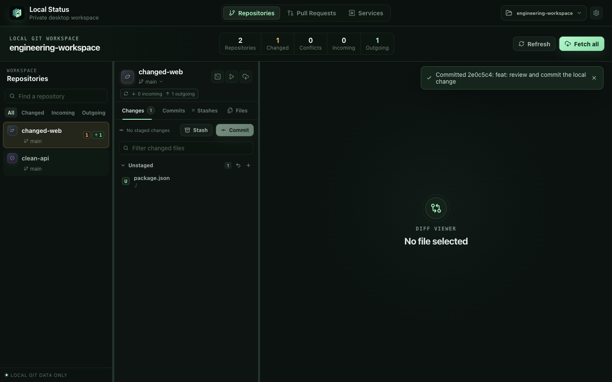
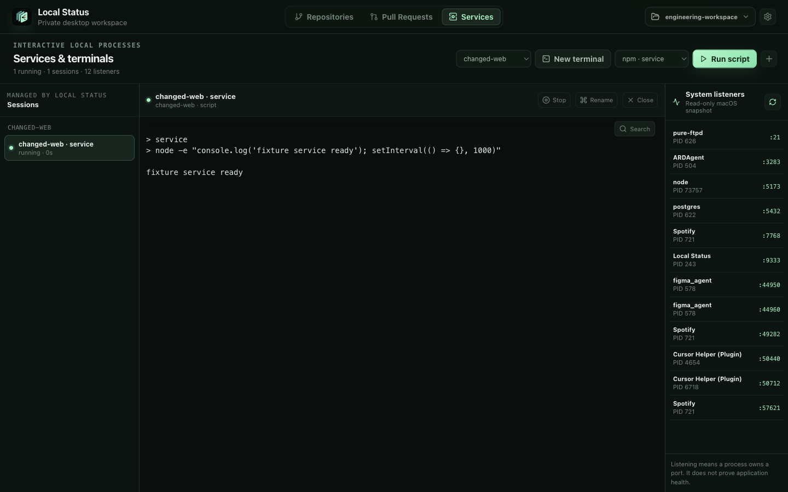

# Local Status

Local Status is a macOS desktop app for working with multiple Git repositories
in one folder.





## Features

- Selected-root or direct-child repository discovery
- Working changes, commits, file trees, and incoming/outgoing status
- Side-by-side and inline Monaco diffs with rendered Markdown previews
- Stage, unstage, stash, commit, revert, fetch, and explicit divergence recovery
- Open pull requests created by you or waiting for your review
- Optional commit-message drafts from an installed Codex or Claude CLI
- Interactive terminals and detected package scripts
- Saved custom service profiles

Repository data, terminal output, paths, and settings stay on your machine.
There is no Local Status account, telemetry, or hosted service. If you
explicitly generate a commit message, the staged diff, file names, statistics,
and recent commit subjects are processed through the selected CLI account after
a provider-specific first-use confirmation. The Pull Requests view fetches
GitHub metadata through your existing authenticated GitHub CLI account; Local
Status does not read or store its credentials.

## Requirements

- macOS
- Node.js 22.13+
- npm
- Git
- Optional: [GitHub CLI](https://cli.github.com/) for the Pull Requests view

## Install

```bash
git clone https://github.com/aters/local-status.git
cd local-status
npm install
npm start
```

On first launch, choose either a Git repository or a folder whose immediate
children are Git repositories. When a selected Git repository also contains
immediate child repositories, Local Status shows the root and children together
as a repository workspace.

## Usage

Select a repository to browse its Changes, Commits, or Files. Selecting a
changed file opens a Monaco comparison. Change groups and files expose Stage,
Unstage, and Revert actions. Revert requires confirmation; reverting an
untracked file permanently deletes it.

Commit opens a review window and commits staged changes only. Write the message
yourself or generate an editable draft with Codex CLI or Claude CLI. Choose the
provider and model in the commit window. Local Status does not read or store CLI
credentials. The saved Generate & Commit switch is off by default. When enabled,
the configured provider drafts the message before Local Status creates the
commit; truncated drafts stop in the editor for review instead.

Stash saves all current changes or one selected file. Bulk stashes include
untracked files by default but never include ignored files. The Stashes tab
shows saved files and diffs. Apply keeps the stash; Pop removes it after a
successful restore. Both restore the original staged state. Restoring over local
changes requires confirmation, and a stash is kept if conflicts occur.

Generated-message input is capped at a 1 MB patch. If the patch is larger, the
model still receives the complete staged file list, status and statistics, plus
recent commit subjects. Local Status marks the draft as truncated so you can
review it more carefully.

Sync fetches the configured upstream, fast-forwards when possible, then pushes
local commits. When local and remote history have diverged, Local Status pauses
and asks you to explicitly choose **Rebase** or **Merge**. Rebase is recommended
for a linear history, but never runs without confirmation. Working changes must
be committed, reverted, or stashed first, and Local Status never force-pushes.

If reconciliation creates conflicts, Git remains paused and the conflicted files
appear in Changes. A persistent recovery panel keeps the terminal, AI assistance,
and full recovery details available after you inspect a file; Sync also changes
to Resume rebase or Resume merge. Edit conflicts in your usual editor or
terminal, then mark the files resolved in Changes. Continue or abort the
operation in a repository terminal. You can optionally open an interactive
Codex or Claude session to resolve and stage conflicted files. The agent uses
normal permission prompts and is instructed not to continue or abort Git,
commit, push, or discard unrelated work.

The **Pull Requests** screen shows open PRs created by the active GitHub CLI
account and PRs currently requesting that account's review. Results are limited
to non-archived `github.com` repositories in the selected workspace, and drafts
remain visible with a Draft badge. Selecting a PR opens it on GitHub in your
default browser.

Install and authenticate GitHub CLI before using the screen:

```bash
brew install gh
gh auth login
```

Use **New terminal** to open a shell in a repository. **Run script** lists
scripts detected from `package.json`. The Services screen keeps running
sessions available while you move between repositories.

The repository interface exposes branch switching and Sync-specific merge or
rebase recovery, but not general-purpose history controls or force-push.
Terminals and interactive AI agents can run local commands, so only use them in
repositories you trust and review their proposed actions.

### Keyboard shortcuts

| Shortcut | Action |
| --- | --- |
| `Cmd/Ctrl+P` | Quick Open files across the workspace |
| `Cmd/Ctrl+F` | Find in the active diff, Markdown preview, terminal, or list |
| `Cmd+Enter` | Commit from the commit window |
| `Enter` | Open the selected repository or file |
| `F7` | Next diff change |
| `Shift+F7` | Previous diff change |

## Development

```bash
npm run dev
npm run build
npm test
npm run lint
npm run test:e2e
```

Project structure:

- `electron/` — Electron main process, IPC, settings, and terminals
- `server/` — Git operations and parsing
- `src/` — React, Monaco, and Xterm interface
- `tests/` — unit, integration, and Electron tests

## Troubleshooting

### `node-pty` fails to install

Confirm the Xcode Command Line Tools are installed, then rebuild:

```bash
xcode-select -p
npm run postinstall
```

### No repositories appear

When the selected folder is a Git repository, Local Status shows that repository
and scans its immediate children for independent repositories or initialized
submodules. The selected repository is marked **Root** when children are found.
For non-Git folders, Local Status scans immediate child folders. More deeply
nested repositories are not included.

### AI message generation is unavailable

Install and sign in to the selected CLI, then reopen the commit window:

```bash
codex login
codex login status

claude auth login
claude auth status
```

If Claude is not installed, choose **Install Claude CLI** in the commit window.
Local Status opens a managed terminal, runs Anthropic's native installer, and
then starts Claude's account sign-in flow. **Locate existing** remains available
for installations in uncommon locations.

### Pull requests are unavailable

Confirm GitHub CLI is installed and signed in to `github.com`:

```bash
gh --version
gh auth status --hostname github.com
```

The Pull Requests view supports `github.com` only and ignores archived,
non-GitHub, or inaccessible repositories.

## License

[MIT](./LICENSE)
